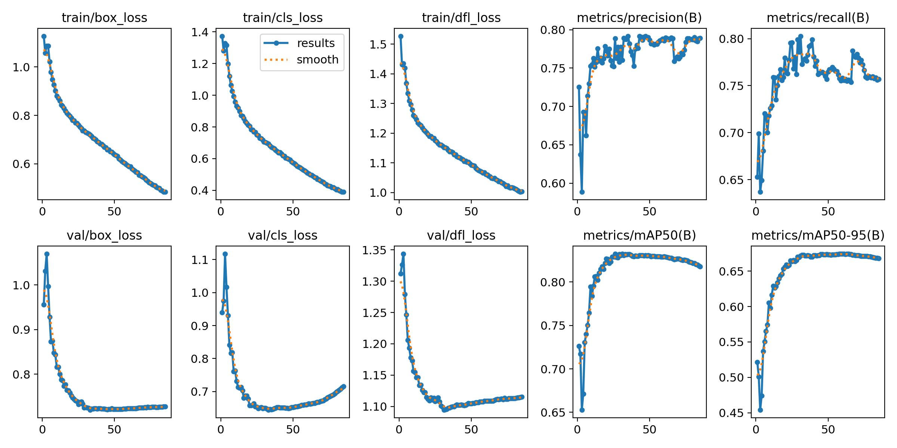
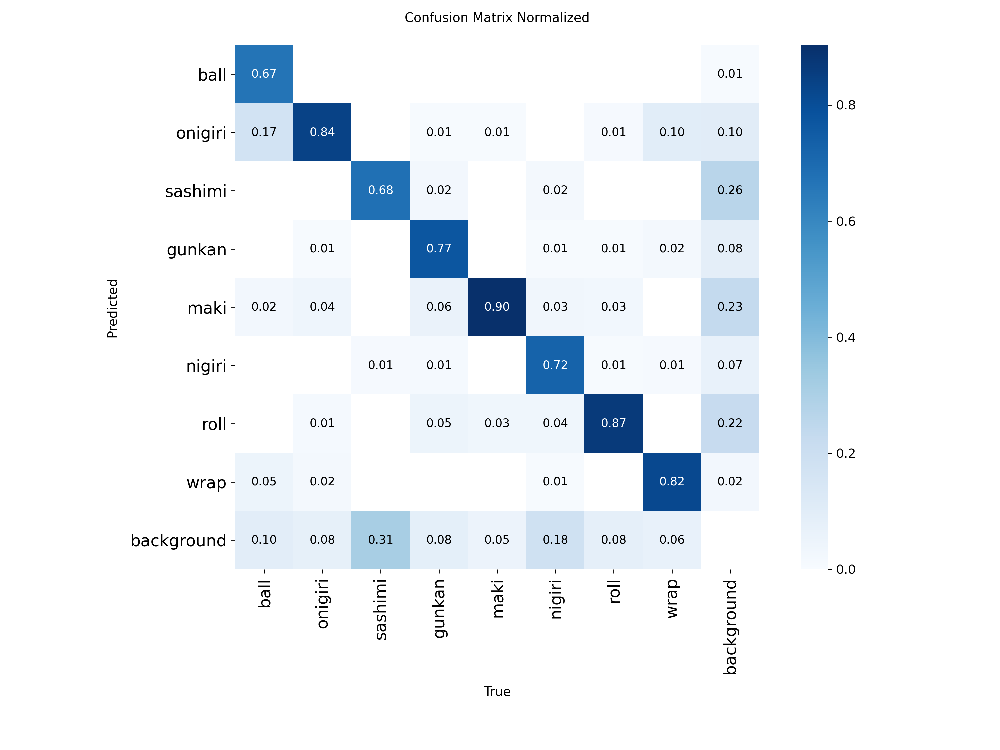

# Memoria Técnica — Sushi Counter

Sistema de detección y conteo de sushi en tiempo real mediante visión artificial.

---

## Índice

1. [Descripción del proyecto](#1-descripción-del-proyecto)
2. [Stack tecnológico](#2-stack-tecnológico)
3. [Dataset](#3-dataset)
4. [Preprocesado](#4-preprocesado)
5. [Pipeline de entrenamiento](#5-pipeline-de-entrenamiento)
6. [Experimentos y resultados](#6-experimentos-y-resultados)
7. [Problemas detectados y soluciones](#7-problemas-detectados-y-soluciones)
8. [Aplicación web](#8-aplicación-web)
9. [Despliegue con Docker](#9-despliegue-con-docker)
10. [Limitaciones conocidas](#10-limitaciones-conocidas)
11. [Conclusiones](#11-conclusiones)

---

## 1. Descripción del proyecto

El objetivo es construir un sistema completo de detección y conteo de tipos de sushi usando una cámara web. El sistema detecta 8 clases:

| Clase | Descripción |
|-------|-------------|
| `ball` | Bola de arroz simple |
| `gunkan` | Gunkan maki (arroz en barco de alga) |
| `maki` | Maki roll (cilindro con alga) |
| `nigiri` | Nigiri (arroz prensado con topping) |
| `onigiri` | Onigiri (triángulo de arroz) |
| `roll` | Roll especial / uramaki |
| `sashimi` | Lonchas de pescado crudo sin arroz |
| `wrap` | Temaki (cono de alga) |

El sistema se compone de:
- Una **red neuronal YOLO11m** entrenada en dos fases
- Un **backend FastAPI** que expone la inferencia vía WebSocket (tiempo real) y REST (imagen estática)
- Un **frontend React** con visualización de bounding boxes y panel de conteo
- Un **contenedor Docker** listo para desplegar

---

## 2. Stack tecnológico

### Machine Learning / Visión Artificial

| Librería | Versión | Uso |
|---------|---------|-----|
| [Ultralytics](https://docs.ultralytics.com/) | ≥ 8.3.0 | YOLO11m — detección de objetos |
| PyTorch | 2.x | Framework de deep learning (CPU en Docker, GPU en entrenamiento) |
| OpenCV (`opencv-python-headless`) | ≥ 4.10.0 | Decodificación de frames, CLAHE, preprocesado |
| NumPy | ≥ 1.26.0 | Operaciones matriciales |

**YOLO11m** es la variante mediana de la familia YOLO11 de Ultralytics. Tiene 20.1M de parámetros y ofrece mejor capacidad de representación que YOLO11s (9.4M) a costa de mayor tiempo de inferencia, lo que lo hace adecuado para una tarea con 8 clases de objetos similares visualmente.

### Backend

| Tecnología | Uso |
|-----------|-----|
| Python 3.11 | Lenguaje principal del backend |
| FastAPI ≥ 0.115 | Framework web asíncrono; gestiona WebSocket y endpoints REST |
| Uvicorn ≥ 0.32 | Servidor ASGI de producción |
| python-multipart | Soporte para subida de ficheros (`multipart/form-data`) |

### Frontend

| Tecnología | Uso |
|-----------|-----|
| React 18 | UI declarativa con hooks |
| Vite | Bundler con HMR para desarrollo; genera `dist/` estático para producción |
| Canvas API | Renderizado de bounding boxes sobre el vídeo/imagen |
| WebSocket API | Comunicación binaria bidireccional con el backend |
| MediaRecorder API | Grabación de vídeo con detecciones superpuestas |

### Infraestructura

| Tecnología | Uso |
|-----------|-----|
| Docker | Contenedor de producción  |
| Docker Compose | Orquestación del servicio con volumen para el modelo |
| Git / GitHub | Control de versiones |

### Herramientas de etiquetado

- **CVAT** (Computer Vision Annotation Tool): herramienta web desplegada localmente para el etiquetado manual de imágenes en formato YOLO.

---

## 3. Dataset

### 3.1 Origen de las imágenes

El dataset raw se encuentra en `Dataset/SushiType/`, organizado en 11 directorios por tipo. Se excluyeron 3 clases ambiguas: `sushi-other`, `sushi-mix` y `sushi-inari`, quedando **8 clases** finales.

Las imágenes son fotos de restaurantes y bandejas reales, con variaciones de iluminación, ángulo y presentación.

### 3.2 Etiquetado manual — dataset base

Se etiquetaron manualmente **~440 imágenes** usando CVAT con formato YOLO (coordenadas normalizadas `cx cy w h`). Este conjunto forma el `dataset_base/` y se usa para el entrenamiento de la fase 1.

Las anotaciones se realizaron en formato:
```
<class_id> <x_center> <y_center> <width> <height>
```
con valores normalizados en [0, 1] respecto al tamaño de imagen.

### 3.3 Auto-etiquetado — dataset_v2

Con el modelo entrenado en la fase 1 se auto-etiquetó el resto del dataset:

- **Umbral de confianza:** 0.65 (solo se aceptan detecciones con alta certeza)
- **Split:** 80% entrenamiento / 20% validación (seed=42)
- **Resultado:** 6 087 imágenes de train + 1 521 de validación

El proceso está implementado en `src/datasets/sushi_dataset.py`.

### 3.4 Data augmentation

Tras analizar la matriz de confusión se detectó que el modelo fallaba en imágenes con **fondo claro o blanco** (caso OOD: las fotos del dataset son casi exclusivamente de bandeja/restaurante con fondo oscuro o texturizado).

Se implementó `scripts/augment_backgrounds.py` con dos estrategias:

#### Variantes bright (gamma=2.8)

Aplica una corrección de gamma alta para simular sobreexposición o iluminación de estudio:

```python
lut = [(i / 255.0) ** (1.0 / gamma) * 255 for i in range(256)]
cv2.LUT(img, lut)
```

Las anotaciones son idénticas (solo cambia la apariencia de la imagen). Se generó **una variante por cada imagen original**.

#### Variantes crop + fondo blanco

Para cada objeto anotado:
1. Se recorta la región del bbox con un **padding del 25%** alrededor
2. Se pega el recorte en el centro de un canvas blanco del mismo tamaño
3. Se recalculan las coordenadas del bbox relativas al nuevo canvas

```python
canvas = np.full((ch, cw, 3), 255, dtype=np.uint8)
canvas[:ch, :cw] = crop
```

Esto genera imágenes de sushi sobre fondo puro blanco similares a fotos de catálogo.

#### Resultado de la augmentation

| Estado | Imágenes de train |
|--------|-----------------|
| dataset_v2 original | 6 087 |
| Tras augmentación | **26 260** |

Solo se modifica el split de train; el split de validación queda intacto para una evaluación honesta.

---

## 4. Preprocesado

El directorio `preprocessing/` contiene 7 scripts que ilustran técnicas clásicas de visión por computador sobre imágenes de muestra. Sirven como análisis exploratorio.

| Script | Técnicas |
|--------|---------|
| `01_color_spaces.py` | BGR, HSV, LAB, histogramas por canal |
| `02_edge_detection.py` | Canny, Sobel (dx/dy), Laplacian |
| `03_thresholding.py` | Otsu, umbralización adaptativa, CLAHE |
| `04_contours.py` | `findContours`, área, perímetro, convex hull, bounding rect |
| `05_morphology.py` | Erosión, dilatación, apertura, cierre, gradiente morfológico |
| `06_segmentation.py` | Watershed, K-means sobre píxeles, GrabCut |
| `07_features.py` | SIFT, ORB (keypoints + descriptores), HOG, filtros Gabor |

Resultados guardados en `results/preprocessing/`. Ejecutar con:

```bash
python preprocessing/run_all.py
```

---

## 5. Pipeline de entrenamiento

El pipeline está implementado en `scripts/train.py` y `src/training/trainer.py` con dos fases diferenciadas.

### 5.1 Fase 1 — Entrenamiento base

Entrena YOLO11m desde pesos preentrenados sobre COCO, usando solo las 440 imágenes etiquetadas manualmente.

**Parámetros:**

```python
epochs=100, imgsz=640, batch=16, amp=True,
patience=20, cache=False, workers=0,
# Augmentación on-the-fly:
degrees=10.0, fliplr=0.5,
hsv_h=0.015, hsv_s=0.7, hsv_v=0.4,
mosaic=1.0, mixup=0.1, copy_paste=0.1
```

- `amp=True`: entrenamiento en FP16 (mixed precision) para reducir VRAM
- `mosaic=1.0`: concatena 4 imágenes en cada batch (augmentación fuerte, mejora detección de objetos pequeños)
- `patience=20`: early stopping si el mAP50 no mejora en 20 épocas
- Salida: `outputs/sushi_base_v1*/weights/best.pt`

### 5.2 Fase 2 — Fine-tuning sobre dataset completo

Fine-tuning desde el checkpoint de la fase 1 sobre el `dataset_v2` completo (o con augmentation).

**Parámetros adicionales respecto a fase 1:**

```python
patience=25, cos_lr=True, cache=False
```

- `cos_lr=True`: scheduler coseno para un decaimiento suave del learning rate en fine-tuning
- `patience=25`: más paciencia para dataset más grande
- Salida: `outputs/sushi_v2m/weights/best.pt` → copiado a `models/best.pt`

### 5.3 Selección de nombre del experimento

YOLO auto-incrementa el nombre del directorio si ya existe (`sushi_v2` → `sushi_v22` → `sushi_v23`…). Para evitar que `retrain()` devuelva una ruta hardcodeada que no existe, el nombre del experimento se determina en función del tamaño del modelo base:

```python
base_size = base_model.stat().st_size if base_model.exists() else 0
exp_name = "sushi_v2m" if base_size > 30_000_000 else "sushi_v2"
```

YOLO11m genera checkpoints de ~40 MB, YOLO11s de ~18 MB.

---

## 6. Experimentos y resultados

### 6.1 Experimento 1 — YOLO11s sobre dataset_v2

**Configuración:** YOLO11s (9.4M params) · 6 087 imágenes de train · sin augmentation adicional

| Métrica | Valor |
|---------|-------|
| mAP50 | **0.852** |
| mAP50-95 | — |

Este modelo fue el punto de partida. Alcanzó buenos resultados generales pero mostraba problemas específicos en validación visual:


### 6.2 Experimento 2 — YOLO11m con augmentación de fondos

**Configuración:** YOLO11m (20.1M params) · 26 260 imágenes de train · augmentación bright + white-bg

| Métrica | Valor |
|---------|-------|
| mAP50 | **0.829** |
| mAP50-95 | 0.588 |
| Precisión | 0.841 |
| Recall | 0.741 |

**Por clase:**

| Clase | mAP50 | Observación |
|-------|-------|-------------|
| maki | 0.923 | Muy buena detección |
| onigiri | 0.906 | Muy buena detección |
| wrap | 0.906 | Mejora notable respecto a experimento 1 |
| roll | 0.893 | Estable |
| ball | 0.879 | Estable |
| gunkan | 0.782 | Aceptable |
| nigiri | 0.739 | Confusión con ball |
| sashimi | 0.602 | Clase más difícil; sin contexto visual claro |

**Nota sobre el mAP50 global (0.829 < 0.852):** el conjunto de validación es exclusivamente de fotos de restaurante. Al entrenar con 26 260 imágenes que incluyen variantes de fondo blanco, la distribución del train se aleja del val → el mAP50 sobre val baja ligeramente. En uso real (imágenes de bandeja de restaurante) el rendimiento visual es similar o superior al del experimento 1.

### 6.3 Curvas de entrenamiento



### 6.4 Matriz de confusión normalizada



Las principales confusiones son:
- `nigiri` ↔ `ball`: morfología similar (arroz prensado vs bola de arroz)
- `sashimi` → background: poca información contextual para lonchas aisladas

---

## 7. Problemas detectados y soluciones

### 7.1 Bounding boxes duplicados

**Síntoma:** 4 cajas para 2 nigiris visibles.

**Causa:** El NMS (Non-Maximum Suppression) de YOLO funde predicciones que se solapan en ≥ IoU_threshold. El valor por defecto es 0.45. Para objetos que el modelo detecta varias veces con desplazamiento pequeño (cada predicción solapa ~30-35%), el NMS no las fusionaba.

**Solución:** Bajar el umbral a `iou=0.3` en la llamada de inferencia:

```python
# app/detector.py
results = model(frame, conf=conf_threshold, iou=0.3, verbose=False)[0]
```

Con `iou=0.3` el NMS fusiona predicciones que se solapen en ≥ 30%. Las piezas separadas raramente solapan tanto, por lo que no hay pérdida de detecciones legítimas.

### 7.2 Bug silencioso en el pipeline de entrenamiento

**Síntoma:** La fase 2 usaba el modelo base de YOLO11s (entrenamiento antiguo) en lugar del nuevo YOLO11m.

**Causa (dos bugs encadenados):**

1. YOLO auto-incrementa el nombre del experimento si el directorio ya existe. La fase 1 guardó los pesos en `outputs/sushi_base_v12/` (no en `sushi_base_v1/` como esperaba el código).
2. `scripts/train.py` buscaba el modelo base solo en `sushi_base_v1/`. Al no encontrarlo, caía al fallback `runs/sushi_base_v1/weights/best.pt`, que era el checkpoint del entrenamiento anterior con YOLO11s.

**Solución:** Ampliar la lista de rutas candidatas en `train.py`:

```python
BASE_MODEL = next(
    (p for p in [
        OUTPUTS_DIR / "sushi_base_v1"  / "weights" / "best.pt",
        OUTPUTS_DIR / "sushi_base_v12" / "weights" / "best.pt",  # añadido
        ROOT / "runs" / "sushi_base_v1" / "weights" / "best.pt",
    ] if p.exists()),
    OUTPUTS_DIR / "sushi_base_v1" / "weights" / "best.pt",
)
```

Y en `trainer.py`, inferir el nombre del experimento desde el tamaño del checkpoint en vez de hardcodearlo.


### 7.3 Preprocesado CLAHE en inferencia

El modelo entrenado en fotos de restaurante es sensible a variaciones de iluminación. Se añadió un paso de **CLAHE** (Contrast Limited Adaptive Histogram Equalization) sobre el canal V (HSV) antes de pasar el frame al modelo:

```python
hsv = cv2.cvtColor(frame, cv2.COLOR_BGR2HSV)
clahe = cv2.createCLAHE(clipLimit=2.0, tileGridSize=(8, 8))
hsv[:, :, 2] = clahe.apply(hsv[:, :, 2])
frame = cv2.cvtColor(hsv, cv2.COLOR_HSV2BGR)
```

CLAHE mejora el contraste local sin sobreexponer las zonas ya brillantes, normalizando la apariencia del frame sin importar las condiciones de luz de la cámara.

---

## 8. Aplicación web

### 8.1 Arquitectura general

```
Modo cámara (tiempo real):
  [Webcam getUserMedia]
        │ canvas.toBlob(JPEG, ~15fps)
        ▼
  [WebSocket /ws/detect]  ──►  [FastAPI]  ──►  [YOLO11m + CLAHE]
                                                        │
  [Canvas overlay]  ◄──  JSON {detections, counts}  ◄──┘
  [CountPanel]

Modo imagen (análisis puntual):
  [File input / drag-drop]
        │ POST /detect (multipart/form-data)
        ▼
  [FastAPI]  ──►  [YOLO11m + CLAHE]
                          │
  [Canvas overlay]  ◄──  JSON {detections, counts}
  [CountPanel]
```

### 8.2 Backend — FastAPI

**Endpoints:**

| Método | Ruta | Descripción |
|--------|------|-------------|
| `WS` | `/ws/detect` | Recibe frames JPEG en binario, devuelve JSON con detecciones |
| `POST` | `/detect` | Analiza imagen estática (`UploadFile`) |
| `GET` | `/health` | Estado del servicio y modelo cargado |

El modelo se carga **una sola vez en el arranque** del servidor (lifespan FastAPI) para evitar latencia en el primer frame:

```python
@asynccontextmanager
async def lifespan(app: FastAPI):
    detector.load_model()
    yield
```

**Prioridad de carga del modelo** (`detector.py`):
1. Variable de entorno `MODEL_PATH` (usada en Docker)
2. `app/models/best.pt`
3. `runs/sushi_v2/weights/best.pt`
4. `runs/sushi_base_v1/weights/best.pt`
5. Modelo preentrenado de fallback `yolo11n.pt`

**Respuesta JSON:**

```json
{
  "detections": [
    {"class": "nigiri", "confidence": 0.903, "bbox": [120, 45, 280, 190]},
    {"class": "maki",   "confidence": 0.876, "bbox": [310, 60, 490, 200]}
  ],
  "counts": {"nigiri": 1, "maki": 1},
  "total": 2
}
```

### 8.3 Frontend — React + Vite

**Componentes principales:**

| Componente | Función |
|-----------|---------|
| `App.jsx` | Estado global, gestión de modos (cámara/imagen), arranque/parada |
| `CameraView.jsx` | Renderiza `<video>` + canvas overlay de detecciones |
| `ImageAnalyzer.jsx` | File input + drag-and-drop; POST al backend; dibuja resultados |
| `CountPanel.jsx` | Panel lateral con conteo por clase y total |
| `RecordControls.jsx` | Botones de grabación |

**Hooks:**

| Hook | Función |
|------|---------|
| `useCamera.js` | `getUserMedia` con resolución preferida; maneja permisos |
| `useWebSocket.js` | Conecta a `/ws/detect`; envía `ArrayBuffer` de frames; recibe JSON |
| `useRecorder.js` | `MediaRecorder` sobre canvas compuesto; descarga `.webm` |

**Pipeline de frames (modo cámara):**

1. `getUserMedia` captura el vídeo
2. Cada 66 ms (~15 fps) se dibuja el frame en un canvas oculto
3. `canvas.toBlob(blob, 'image/jpeg', 0.8)` genera JPEG comprimido
4. Se envía como `ArrayBuffer` por WebSocket
5. La respuesta JSON se procesa en `drawDetections()` y `CountPanel`

**Grabación de vídeo:**

La grabación no usa directamente el stream de vídeo, sino un **canvas compuesto oculto** donde se dibuja tanto el frame como las cajas de detección. Esto permite que el `.webm` descargado incluya las anotaciones superpuestas.

### 8.4 Modo imagen

Añadido para facilitar la demostración sin cámara web. Acepta archivos por:
- Clic en botón → `<input type="file" accept="image/*">`
- Drag-and-drop sobre el área de visualización

El flujo:
1. Se dibuja la imagen en el canvas
2. Se envía como `multipart/form-data` al endpoint `POST /detect`
3. Se redibuja la imagen y se superponen las cajas de detección

`drawDetections()` acepta un parámetro `clearFirst`:
- `clearFirst=true` (por defecto, modo cámara): limpia el canvas antes de dibujar
- `clearFirst=false` (modo imagen): no limpia, para no borrar la imagen de fondo

---

## 9. Despliegue con Docker

### 9.1 Dockerfile multi-stage

**Stage 1 — Build del frontend:**

```dockerfile
FROM node:20-slim AS frontend-builder
WORKDIR /build
COPY frontend/package*.json ./
RUN npm ci --silent
COPY frontend/ ./
RUN npm run build
```

Genera `dist/` estático que FastAPI sirve directamente.

**Stage 2 — Backend Python:**

```dockerfile
FROM python:3.11-slim
# Dependencias de sistema para OpenCV
RUN apt-get install -y libglib2.0-0 libsm6 libxrender1 libxext6 libgl1

# PyTorch CPU-only primero (evita descargar ~2 GB de CUDA)
RUN pip install torch torchvision --index-url https://download.pytorch.org/whl/cpu
# Ultralytics sobreescribe uvicorn — reinstalar al final
RUN pip install -r requirements.txt
RUN pip install --force-reinstall "uvicorn[standard]>=0.32.0" "fastapi>=0.115.0"
```

El trick de reinstalar uvicorn al final es necesario porque `ultralytics` sobreescribe los ficheros de uvicorn durante su instalación, rompiendo el servidor.

**Tamaño final de imagen:** ~500 MB (sin CUDA; con CUDA serían ~3 GB).

### 9.2 docker-compose.yml

```yaml
services:
  sushi-detector:
    build:
      context: ./app
      dockerfile: Dockerfile
    ports:
      - "8080:8000"
    volumes:
      - ./models/best.pt:/app/models/best.pt:ro   # modelo montado read-only
    environment:
      - MODEL_PATH=/app/models/best.pt
    restart: unless-stopped
```

El modelo se monta como volumen para poder actualizarlo sin reconstruir la imagen.

### 9.3 Comandos

```bash
docker compose up -d           # arrancar (construye en primer uso)
docker compose up --build -d   # reconstruir imagen
docker compose down            # parar
docker compose logs -f         # ver logs
```

Aplicación disponible en **http://localhost:8080**.

---

## 10. Limitaciones conocidas

### Imágenes de catálogo sobre fondo blanco puro

Las fotos de producto (temaki o sashimi sobre fondo completamente blanco) tienen detección pobre o nula. El dataset de entrenamiento es casi exclusivamente de fotos de bandeja en restaurante. Las variantes `whitebg__` generadas por augmentación son recortes de esas mismas fotos de restaurante pegados en blanco, por lo que no replican exactamente el estilo de una foto de catálogo con iluminación uniforme.

**Para una demo con el profesor:** usar fotos de restaurante o de bandeja da mejores resultados que imágenes de stock sobre fondo blanco.

### Clase sin cobertura: guarniciones

El modelo confunde los adornos de wasabi o jengibre con nigiris o bolas de arroz porque no existe ninguna clase "guarnición" o "otro" en el dataset. Cuando la cámara enfoca un plato con wasabi visible, aparece una detección falsa.

**Solución teórica:** añadir una clase `other` con ejemplos anotados de guarniciones. No se implementó por ser fuera del alcance del proyecto.

### Confusión nigiri / ball en imágenes de baja resolución

En imágenes pequeñas o recortadas, nigiri y ball son visualmente idénticos (ambos son arroz prensado de forma similar). El modelo comete errores en ese caso sin solución posible sin más contexto visual.

### Inferencia en CPU (Docker)

La imagen Docker usa PyTorch CPU. El tiempo de inferencia por frame es ~200-400 ms en CPU vs ~20-40 ms en GPU. A 15 fps (66 ms/frame) el servidor puede generar cola si no se gestiona el backpressure en el WebSocket. En CPU el framerate efectivo baja a ~3-5 fps según el hardware del servidor.

---

## 11. Conclusiones

Se ha construido un sistema completo de extremo a extremo para detección y conteo de sushi:

- **Dataset:** construido con etiquetado manual + auto-etiquetado + augmentación, pasando de 440 imágenes iniciales a 26 260 en entrenamiento
- **Modelo:** YOLO11m entrenado en dos fases, alcanzando mAP50=0.829 con las 8 clases
- **Aplicación:** web en tiempo real con WebSocket, modo imagen para demos sin cámara, grabación de vídeo con anotaciones
- **Despliegue:** contenedor Docker reproducible con un solo comando

Las principales dificultades fueron los bugs silenciosos en el pipeline de entrenamiento (rutas hardcodeadas + auto-incremento de YOLO) y la distribución sesgada del dataset (casi exclusivamente fotos de restaurante). Los resultados son sólidos para casos de uso realistas; las limitaciones en fondos blancos son conocidas y documentadas.

---

*Imágenes de métricas generadas automáticamente por Ultralytics durante el entrenamiento (`outputs/sushi_v2m/`).*
